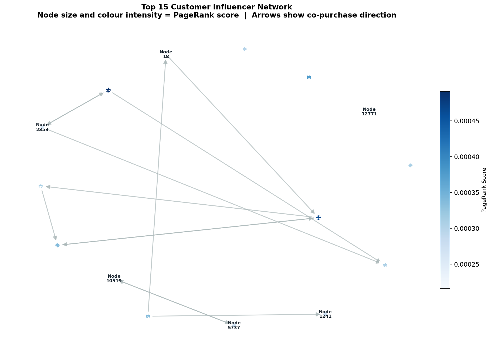
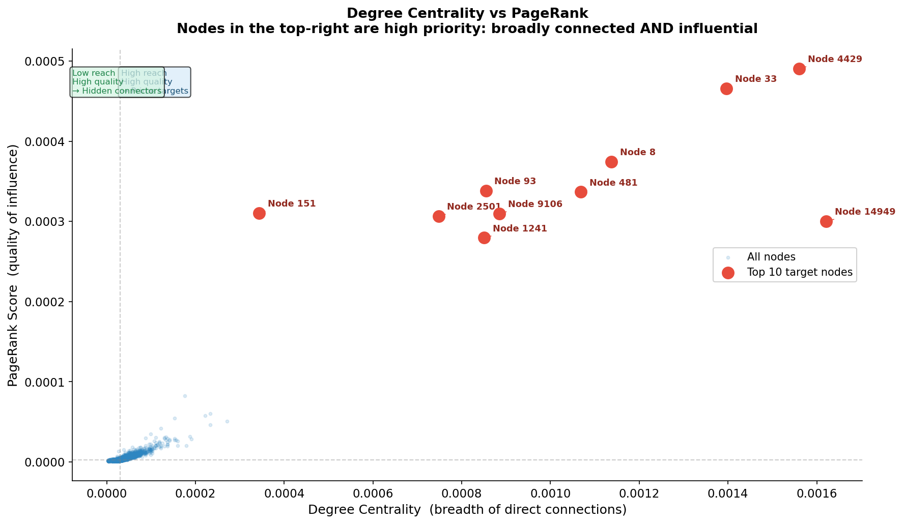
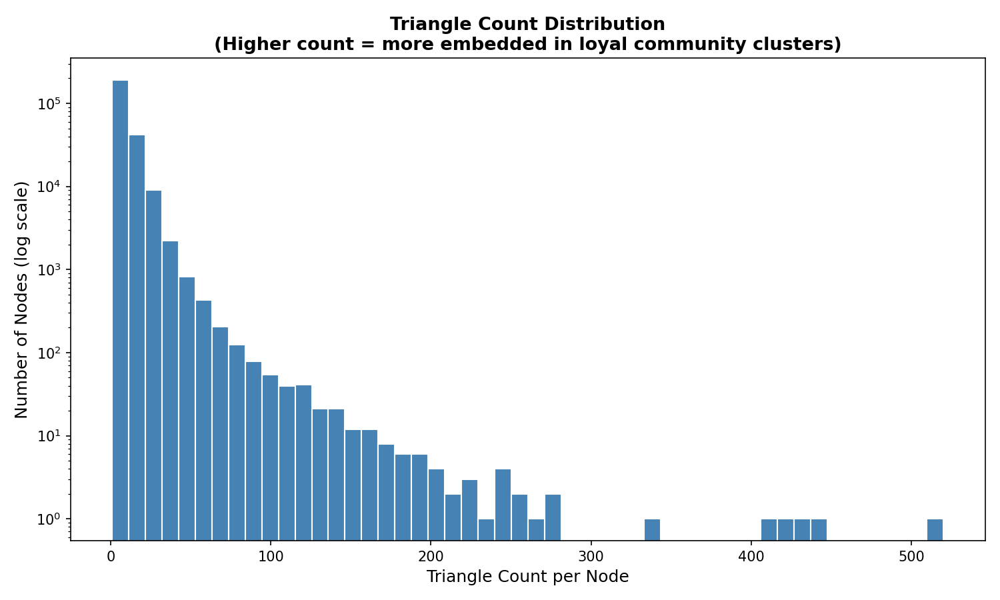

# Customer Influence Network — Graph Analytics Project

A graph analytics project that models Amazon co-purchase data as a customer
influence network to identify high-value nodes and inform targeted marketing strategy.

---

## Business Problem
Which customers should a business target first to maximise word-of-mouth growth
at the lowest acquisition cost?

Traditional approaches use demographics. This project uses network structure —
treating customer relationships as a graph and letting the data reveal influence organically.

---

## Dataset
- **Source:** Stanford SNAP — Amazon Co-Purchase Network
- **Nodes:** 262,111 (products/customers)
- **Edges:** 1,234,877 (co-purchase relationships)
- **Link:** https://snap.stanford.edu/data/amazon0302.html

---

## Methods

| Method | Purpose | Business Use |
|---|---|---|
| Degree Centrality | Direct connection count | Reach estimation |
| PageRank | Quality-weighted influence | Target prioritisation |
| Label Propagation | Community detection | Customer segmentation |
| Triangle Counting | Cluster embeddedness | Loyalty signal |

---

## Key Findings
- Nodes 4429 and 33 rank in the top 10 for both degree centrality and PageRank — 
  ideal first targets for referral campaigns
- Degree centrality alone is a misleading targeting metric — PageRank reveals 
  connection quality, not just quantity
- Community detection identified distinct behavioural segments without any 
  demographic data
- High triangle count nodes represent loyal, trust-embedded customers with 
  lowest churn risk

## Visualisations

### Influencer Network


### Degree vs PageRank


### Triangle Distribution


---

## Project Structure
```
customer-influence-network/
│
├── data/                          # Raw dataset
│   └── Amazon0302.txt
│
├── src/                           # Analysis scripts
│   ├── centrality_analysis.py     # Degree centrality + PageRank
│   ├── community_detection.py     # Label propagation segmentation
│   ├── triangle_counting.py       # Triangle count + clustering coefficient
│   └── visualization.py           # All plots and charts
│
├── outputs/                       # Generated results
│   ├── centrality_results.csv
│   ├── community_results.csv
│   ├── triangle_results.csv
│   ├── influencer_network.png
│   ├── degree_vs_pagerank.png
│   └── triangle_distribution.png
│
├── analysis/
│   └── business_insights.md       # Business interpretation of findings
│
├── requirements.txt
└── README.md
```
---

## Strategic Recommendations

1. **Target nodes 4429 and 33 first** — highest combined influence
   score across both reach and connection quality metrics.

2. **Segment campaigns by community** — each detected community
   represents a distinct behavioural cluster requiring a tailored
   marketing message.

3. **Use triangle count as a loyalty proxy** — high triangle nodes
   are deeply embedded in peer groups and respond better to
   retention offers than acquisition campaigns.

4. **Combine PageRank + degree centrality** for targeting — neither
   metric alone is sufficient for prioritisation decisions.

---

## My Contribution
This is an independent project built to explore the application
of graph analytics to real-world business problems.

- Designed the analytical framework and business problem formulation
- Implemented the full pipeline from data loading to insight generation
- Interpreted graph metrics in a business analytics context
- Produced visualisations and strategic recommendations from raw results

---

## Tech Stack
- Python
- NetworkX
- Pandas
- Matplotlib
- Stanford SNAP Dataset

---

## Future Improvements
- Incorporate product category metadata to label communities meaningfully
- Add weighted edges based on purchase frequency
- Scale pipeline using distributed graph processing frameworks
- Build an interactive dashboard for exploring influence metrics

---

## References
- J. Leskovec, L. Adamic and B. Adamic. [The Dynamics of Viral Marketing](https://dl.acm.org/doi/10.1145/1232722.1232727). ACM Transactions on the Web, 2007.
- Stanford SNAP: https://snap.stanford.edu/data/amazon0302.html
